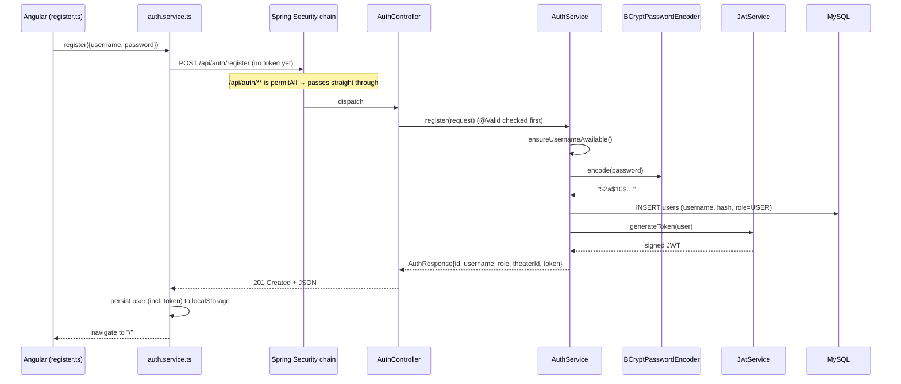
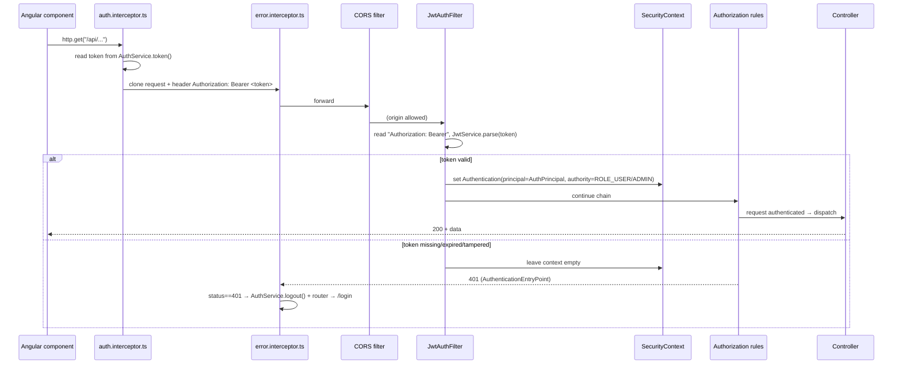
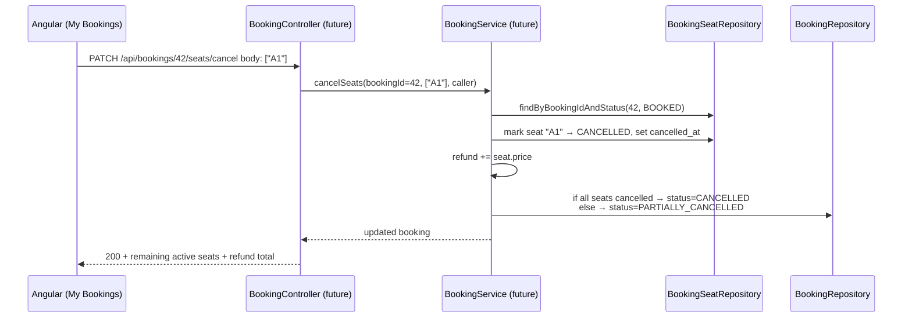

# CineBook — Application Flow & Architecture

A detailed walkthrough of how CineBook works, request by request, covering the features
implemented so far: **JWT authentication** (BCrypt-hashed passwords, stateless tokens,
Spring Security) and the **partial-cancellation schema** (per-seat data model that lets a
single seat in a booking be cancelled/refunded independently).

---

## 1. High-level architecture

CineBook is a two-tier web app:

| Layer | Technology | Port |
|-------|-----------|------|
| **Frontend** | Angular 17 (standalone components, signals) | `http://localhost:4200` |
| **Backend** | Spring Boot 3.3.5 / Java 21 (layered REST API) | `http://localhost:8181` |
| **Database** | MySQL 8 (schema `cinebook`) | `localhost:3306` |

In development the Angular dev server **proxies** every `/api/*` call to the backend
(`frontend/proxy.conf.json`), so the browser sees a single origin and CORS is only exercised
in non-proxied setups. The backend is still configured for CORS from `http://localhost:4200`.

```
┌──────────────┐   /api/** (proxied)   ┌────────────────────┐   JDBC   ┌──────────┐
│  Angular SPA │ ────────────────────► │  Spring Boot API   │ ───────► │  MySQL   │
│  :4200       │ ◄──────────────────── │  :8181             │ ◄─────── │  cinebook│
└──────────────┘     JSON + JWT        └────────────────────┘          └──────────┘
```

The backend is **stateless**: it keeps no server-side session. Every request must carry its own
proof of identity — a JWT in the `Authorization` header. This is the core of the auth design.

---

## 2. Backend layering (how one request travels)

Every API request passes through these layers in order:

```
HTTP request
   │
   ▼
[ Servlet / Tomcat ]
   │
   ▼
[ Spring Security filter chain ]   ← CORS check, then JwtAuthFilter validates the token
   │                                  and puts the caller's identity into the SecurityContext
   ▼
[ Controller ]   (@RestController)  ← maps URL + verb, validates request body (@Valid)
   │
   ▼
[ Service ]      (@Service)         ← business logic, @Transactional boundaries
   │
   ▼
[ Repository ]   (JpaRepository)    ← Spring Data generates SQL
   │
   ▼
[ MySQL ]
```

Cross-cutting:
- **`GlobalExceptionHandler`** (`@RestControllerAdvice`) converts thrown exceptions into clean
  JSON error responses with the right HTTP status.
- **`SecurityConfig`** decides which URLs are public vs. protected.

Key backend packages (`backend/src/main/java/com/cinebook/`):

```
config/      SecurityConfig, CorsConfig
security/    JwtService, JwtAuthFilter, AuthPrincipal
controller/  AuthController
service/     AuthService
repository/  UserRepository, BookingRepository, BookingSeatRepository, … (8 total)
entity/      User, Booking, BookingSeat, Show, Movie, Theater, … + enums
dto/         LoginRequest, RegisterRequest, RegisterAdminRequest, AuthResponse
exception/   ApiException, GlobalExceptionHandler
```

---

## 3. Feature: JWT Authentication

### 3.1 What changed vs. before

| Before | Now |
|--------|-----|
| Passwords stored in **plaintext** | Passwords **BCrypt-hashed** (`$2a$10$…`, 60 chars) |
| No Spring Security | **Spring Security** filter chain guards the API |
| Identity faked via `X-User-Id` / `X-Role` headers (unverified — anyone could impersonate anyone) | Identity proven by a **signed JWT** the server issues and verifies |
| Frontend `identity.interceptor` | Frontend `auth.interceptor` sends `Authorization: Bearer <token>` |

### 3.2 The token

A JWT minted by `JwtService.generateToken(user)`:
- **subject** = username
- **claims** = `userId`, `role` (`USER`/`ADMIN`), `theaterId`
- **issuedAt / expiration** = now … now + 24h (`app.jwt.expiration-ms = 86400000`)
- **signature** = HMAC using the secret in `app.jwt.secret`

Because it is signed, the server can trust its contents without a database lookup or a session.

### 3.3 Registration flow

`POST /api/auth/register` (regular user) or `POST /api/auth/register-admin` (theater owner).



`registerAdmin` does the same but also creates a `Theater` row and links it back to the admin
(`user.theaterId`). The response carries the token, so a freshly registered user is **immediately
logged in** — no second round-trip.
```mermaid
sequenceDiagram
    participant UI as Angular (login.ts)
    participant AS as auth.service.ts
    participant C as AuthController
    participant SVC as AuthService
    participant ENC as BCryptPasswordEncoder
    participant JWT as JwtService
    participant DB as MySQL

    UI->>AS: login({username, password})
    AS->>C: POST /api/auth/login (public)
    C->>SVC: login(request)
    SVC->>DB: findByUsername(username)
    DB-->>SVC: User (with stored hash)
    SVC->>ENC: matches(rawPassword, storedHash)
    
    alt password correct
        ENC-->>SVC: true
        SVC->>JWT: generateToken(user)
        JWT-->>SVC: Token
        SVC-->>C: AuthResponse{… , token}
        C-->>AS: 200 OK
        AS->>AS: store user+token in localStorage; set currentUser signal
    else password wrong / user missing
        ENC-->>SVC: false (or DB returns empty)
        SVC-->>C: throw ApiException.unauthorized(...)
        C-->>AS: 401 Unauthorized
        AS-->>UI: show "Invalid username or password"
    end
```
Crucially, the server never compares plaintext — `passwordEncoder.matches()` re-hashes the
submitted password and compares hashes. (This is why the legacy plaintext accounts can no longer
log in and the dev data must be reset.)

### 3.5 Authenticated request flow (the heart of JWT)

Once logged in, **every** subsequent API call carries the token and is validated by the filter
chain before reaching any controller.



What each piece does:

- **`auth.interceptor.ts`** — attaches `Authorization: Bearer <token>` to outgoing requests
  (no-op if logged out).
- **CORS** (`CorsConfig` → `CorsConfigurationSource` bean) — wired into the security chain via
  `http.cors()`, allows `localhost:4200` with credentials.
- **`JwtAuthFilter`** (`OncePerRequestFilter`, runs **before** `UsernamePasswordAuthenticationFilter`)
  — extracts the bearer token, calls `JwtService.parse()` to verify signature + expiry, builds an
  `AuthPrincipal(userId, username, role, theaterId)`, and stores it in the `SecurityContext` with a
  `ROLE_USER` / `ROLE_ADMIN` authority. Invalid tokens leave the context empty (no exception thrown
  there).
- **`SecurityConfig`** — `/api/auth/**` is `permitAll`; everything else is `authenticated()`.
  Unauthenticated calls to protected URLs hit the `AuthenticationEntryPoint`, which returns a clean
  **401** (not a login redirect). `@EnableMethodSecurity` allows future `@PreAuthorize("hasRole('ADMIN')")`
  on individual endpoints.
- **`error.interceptor.ts`** — on any **401**, it clears the stored session and routes to `/login`
  (the client-side equivalent of "your token expired, sign in again").

### 3.6 Frontend session & route protection

- **`AuthService`** holds `currentUser` as an Angular **signal**, restored from `localStorage`
  (`cinebook.user`) on load, so a page refresh keeps you logged in. Derived signals: `isLoggedIn`,
  `isAdmin`, and `token` (used by the interceptor).
- **Route guards** (`app.routes.ts`):
  - `authGuard` → protects `/` (home); redirects to `/login` if not logged in.
  - `adminGuard` → ready for admin-only routes (`isAdmin`).
- **Logout** clears `localStorage` and the signal; guards then block protected routes.

```
/login, /register   → public
/                   → authGuard (must be logged in)
**                  → redirect to /
```

---

## 4. Feature: Partial-cancellation schema

### 4.1 The problem it solves

Originally a booking stored its seats as a single CSV string (`Booking.seats = "A1,A2,B5"`) and
its status was all-or-nothing (`CONFIRMED` / `CANCELLED`). There was no way to cancel **one** seat
out of several. We normalized the data so each seat is individually addressable.

### 4.2 New / changed schema

**New entity `BookingSeat`** → table `booking_seats` (one row per booked seat):

| column | type | purpose |
|--------|------|---------|
| `id` | bigint PK | |
| `booking_id` | bigint | FK → `bookings.id` (plain column, matching the project's no-`@ManyToOne` convention) |
| `seat_label` | varchar(10) | e.g. `"A1"` |
| `price` | decimal(10,2) | per-seat price → enables **per-seat refund math** |
| `status` | enum(`BOOKED`,`CANCELLED`) | current state of *this* seat |
| `cancelled_at` | datetime | when this seat was cancelled (nullable) |

**Enum changes:**
- `BookingStatus`: `CONFIRMED, PARTIALLY_CANCELLED, CANCELLED` (added the middle value).
- New `SeatStatus`: `BOOKED, CANCELLED`.

**`Booking` entity:** `seats` (CSV) is kept as the **immutable original snapshot** of what was
booked; the `BookingSeat` rows are now the **authoritative current state**. `refundAmount` and the
booking-level `status` will be recomputed from the seat rows when the cancellation logic is built.

**New repository** `BookingSeatRepository`: `findByBookingId`, `findByBookingIdAndStatus`,
`findByBookingIdInAndStatus` (the last supports future show-level seat-availability checks).

Spring/Hibernate auto-applies this schema on startup (`spring.jpa.hibernate.ddl-auto=update`) — no
manual migration scripts.

### 4.3 How a future cancellation will flow (data model is ready; logic not yet built)

This is the intended flow the schema now supports — included so the design rationale is clear:



Because each seat carries its own `price` and `status`, cancelling `"A1"` only touches that one
row, the refund is exactly that seat's price, and the parent booking flips to
`PARTIALLY_CANCELLED` until the last seat is gone.

> **Out of scope for now:** Stripe / payment-gateway integration and the booking & cancellation
> *business logic* (controllers/services) were intentionally deferred. The per-seat `price` +
> `Booking.refundAmount` fields are deliberately retained so a payment gateway can later issue
> partial refunds seat by seat.

---

## 5. End-to-end example: a logged-in user lists their bookings

Putting every layer together for one real request (`GET /api/bookings/mine`, illustrative):

1. **Component** calls `bookingService.mine()` → Angular `HttpClient`.
2. **`auth.interceptor`** adds `Authorization: Bearer eyJ…`.
3. **Proxy** forwards `:4200/api/...` → `:8181/api/...`.
4. **CORS filter** allows the origin.
5. **`JwtAuthFilter`** verifies the token, sets `AuthPrincipal{userId=6, role=USER}` in the
   `SecurityContext`.
6. **Authorization rules** see the request is authenticated → allow.
7. **Controller** reads the caller via `@AuthenticationPrincipal AuthPrincipal` (so the user can
   only ever query *their own* `userId` — identity comes from the verified token, never from a
   client-supplied header).
8. **Service** calls `bookingRepository.findByUserIdOrderByBookingDateDesc(6)` and, per booking,
   `bookingSeatRepository.findByBookingId(...)` for live seat state.
9. **Repository → MySQL** runs the SQL; rows map back to entities.
10. **Response** serialized to JSON → travels back up. If the token had been invalid, step 5 would
    have produced a **401**, and **`error.interceptor`** would have logged the user out.

---

## 6. Verification performed

The implementation was tested against the running backend + MySQL:

| Check | Result |
|-------|--------|
| Register → returns JWT | ✅ 194-char signed token |
| Login → returns JWT | ✅ |
| Protected endpoint **without** token | ✅ 401 |
| Protected endpoint **with** token | ✅ passes the security filter |
| Login with **wrong** password | ✅ 401 |
| Stored password format | ✅ BCrypt `$2a$10$…` (60 chars) |
| `booking_seats` table created | ✅ with `status enum('BOOKED','CANCELLED')` |
| `bookings.status` enum | ✅ now includes `PARTIALLY_CANCELLED` |

---

## 7. File map (what to point your mentor at)

**Backend**
- Security: `config/SecurityConfig.java`, `config/CorsConfig.java`,
  `security/JwtService.java`, `security/JwtAuthFilter.java`, `security/AuthPrincipal.java`
- Auth: `controller/AuthController.java`, `service/AuthService.java`, `dto/AuthResponse.java`
- Schema: `entity/BookingSeat.java`, `entity/SeatStatus.java`, `entity/BookingStatus.java`,
  `entity/Booking.java`, `repository/BookingSeatRepository.java`
- Config: `resources/application.properties` (`app.jwt.secret`, `app.jwt.expiration-ms`)

**Frontend**
- `core/interceptors/auth.interceptor.ts`, `core/interceptors/error.interceptor.ts`
- `core/services/auth.service.ts`, `core/guards/auth.guard.ts`, `core/guards/admin.guard.ts`
- `core/models/user.model.ts` (`AuthUser.token`), `core/models/catalog.model.ts`
  (`BookingSeat`, `SeatStatus`, `PARTIALLY_CANCELLED`)
- `app.config.ts` (interceptor registration), `app.routes.ts` (guards)
